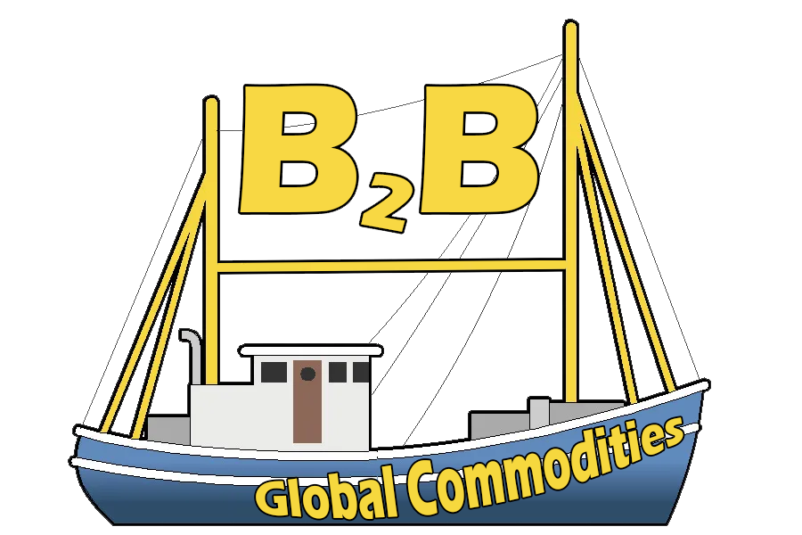

# Grupal Project - B2B Commodities

  

## Idea of the project

Online B2B forum (Business to Business) for importers/exporters
International Commodities. Users generate “posts”
where they can offer/find products. The idea of the forum is to facilitate
contact between buyers and sellers about the specified product,
provide seller/buyer information through your membership
as a user (Free, Trial, Basic, Premium).
Users can be both buyers and sellers.
Each membership has its particular benefits.
International trade is handled between contracts through
intermediaries, where the page is reserved solely for providing information on
the parts.

## Students in the project

- Cesar Herbert Jelvez                  || GitHub:
- Juan Diego Mas                        || GitHub: https://github.com/intelligentdnb
- Leandro Benjanmin Quiroga             || GitHub: https://github.com/lbenjaminq
- Marcos Gabriel Servezynski Gómez      || GitHub: https://github.com/ServezynskiMarcos
- Maximiliano Marolda                   || GitHub: https://github.com/MaxiMarolda
- Nicolás Martin Sánchez Long           || GitHub:
- Pablo Barbero                         || GitHub: https://github.com/BarberoPablo